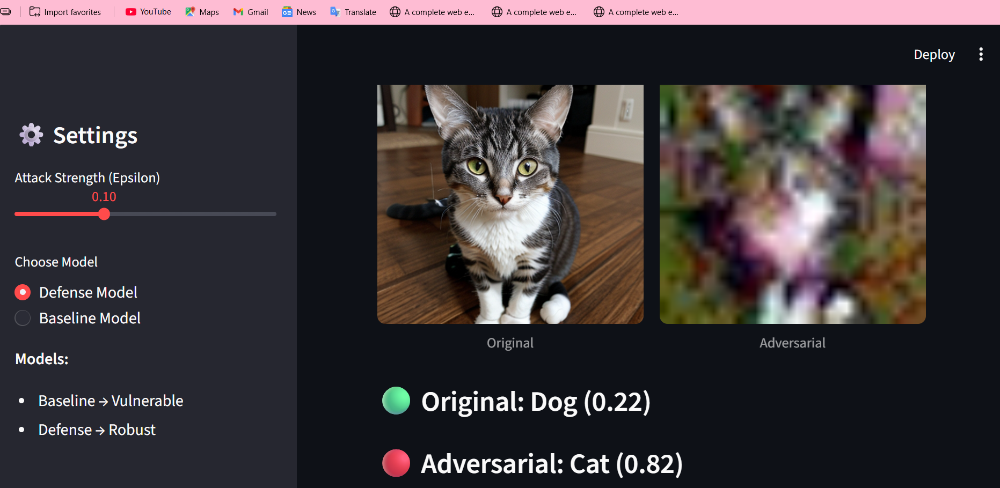
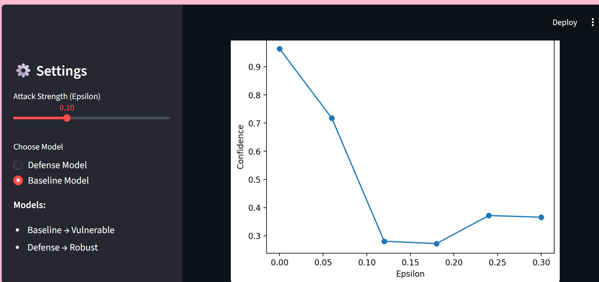
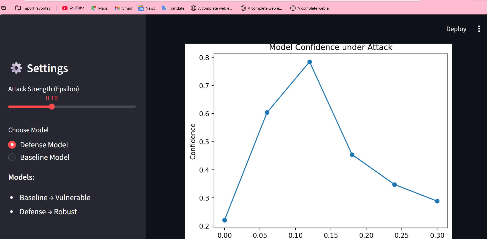

# 🛡️ Adversarial Attack & Defense Framework

**Python | PyTorch | Deep Learning | Adversarial Machine Learning | AI Security**

A deep learning framework to analyze how vulnerable neural networks are to **adversarial attacks**, and to evaluate defense techniques that improve model robustness.

---

## 📌 Overview

Deep learning models can be fooled by **adversarial examples** — inputs with small, carefully crafted perturbations that cause incorrect predictions, even though the changes are barely visible to the human eye.

This project demonstrates:

- The effect of adversarial attacks on a trained model
- How much robustness improves after **adversarial training**

---

## 🎯 Key Features

| Feature | Description |
|---|---|
| ⚡ FGSM Attack | Fast Gradient Sign Method for generating adversarial examples |
| 🧠 Baseline Model | Standard model trained without any defense |
| 🛡️ Adversarial Training | Defense technique that trains on adversarial examples |
| 📊 Model Comparison | Baseline vs. defended model performance |
| 🔍 Prediction Analysis | Original vs. adversarial predictions side by side |
| 📈 Visualizations | Graphs for accuracy, loss, and robustness trends |

---

## 🧠 How It Works

```text
                Dataset
                   │
                   ▼
         Train Baseline Model
                   │
                   ▼
   Generate Adversarial Examples (FGSM)
                   │
                   ▼
        Evaluate Baseline Model
                   │
                   ▼
         Adversarial Training
                   │
                   ▼
         Train Defense Model
                   │
                   ▼
        Evaluate Defense Model
                   │
                   ▼
            Compare Results
```

---

## ⚡ Adversarial Attack — FGSM

The project uses the **Fast Gradient Sign Method (FGSM)** to generate adversarial examples:

```
x_adv = x + ε * sign(∇x J(θ, x, y))
```

| Symbol | Meaning |
|---|---|
| `x` | Original input |
| `x_adv` | Adversarial input |
| `ε` | Perturbation strength |
| `J` | Loss function |
| `θ` | Model parameters |
| `∇x` | Gradient of loss w.r.t. input |

FGSM perturbs the input in the direction that maximizes the model's loss — often enough to flip its prediction.

---

## 🛡️ Defense — Adversarial Training

Adversarial examples are injected into the training loop itself, forcing the model to learn features that hold up under perturbation. The resulting **defense model** is then benchmarked against the baseline.

---

## 📊 Evaluation

The framework evaluates:

- Predictions on original vs. adversarial inputs
- Baseline model performance under attack
- Defense model performance under attack
- Overall robustness improvement from adversarial training

---

## 🛠️ Tech Stack

- 🐍 Python
- 🔥 PyTorch
- 🔢 NumPy
- 📊 Matplotlib
- 🎨 Seaborn

---

## 📁 Project Structure

```
Adversarial-Attack-Defense/
│
├── attacks/
├── defenses/
├── models/
├── utils/
├── data/
│
├── app.py
├── evaluate.py
├── train_baseline.py
├── train_defence.py
│
├── images/
│   ├── defense_prediction.png
│   ├── baseline_graph.png
│   └── defense_graph.png
│
├── README.md
├── requirements.txt
└── .gitignore
```

> **Note:** Large model weights (`.pth`) and datasets are excluded from the repo to keep it lightweight.

---

## ⚙️ Installation

**1. Clone the repository**
```bash
git clone https://github.com/your-username/Adversarial-Attack-Defense.git
cd Adversarial-Attack-Defense
```

**2. Create a virtual environment**
```bash
python -m venv venv
```

**3. Activate it**

Windows:
```bash
venv\Scripts\activate
```

Linux / macOS:
```bash
source venv/bin/activate
```

**4. Install dependencies**
```bash
pip install -r requirements.txt
```

---

## ▶️ Usage

```bash
# Train the baseline model
python train_baseline.py

# Train the defense model
python train_defence.py

# Evaluate both models
python evaluate.py

# Run the application
python app.py
```

> Make sure the required dataset and model weights are available before running each script.

---

## 📸 Results & Visualizations

### 🔹 Defense Model — Original vs. Adversarial Prediction


### 🔹 Baseline Model — Performance Comparison


### 🔹 Defense Model — Performance Comparison


---

## 📊 Key Observations

- Adversarial perturbations can significantly affect model predictions.
- Even small, near-invisible changes to input data can flip predictions.
- The baseline model is noticeably more vulnerable under adversarial conditions.
- Adversarial training meaningfully improves robustness.
- Visualizations make the attack/defense trade-off easy to interpret.

---

## 🎓 Applications

- 🔐 AI Model Security
- 🛡️ Adversarial Machine Learning
- 🤖 Robust Deep Learning
- 🔍 Model Vulnerability Analysis
- 📊 AI Security Research

---

## 🚀 Future Improvements

- [ ] Implement PGD (Projected Gradient Descent)
- [ ] Implement Carlini & Wagner (CW) attacks
- [ ] Add more defense techniques
- [ ] Evaluate across multiple attack strengths
- [ ] Test on different neural network architectures
- [ ] Extend experiments to larger datasets
- [ ] Add automated robustness evaluation

---

## 🤝 Contributing

Contributions, improvements, and suggestions are welcome — feel free to open an issue or PR.

---

## 📄 License

This project is intended for **educational and research purposes**.

---

## 🙌 Author

**Vidit Sharma**
B.Tech CSE (AI & ML) — Galgotias University
